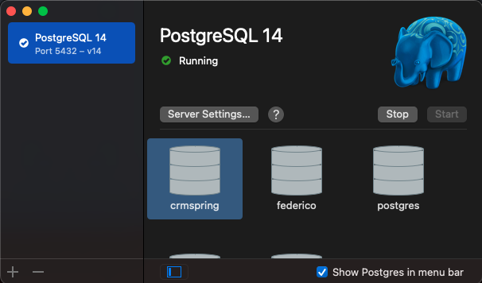
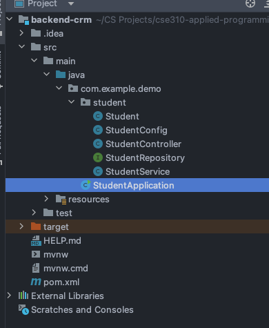
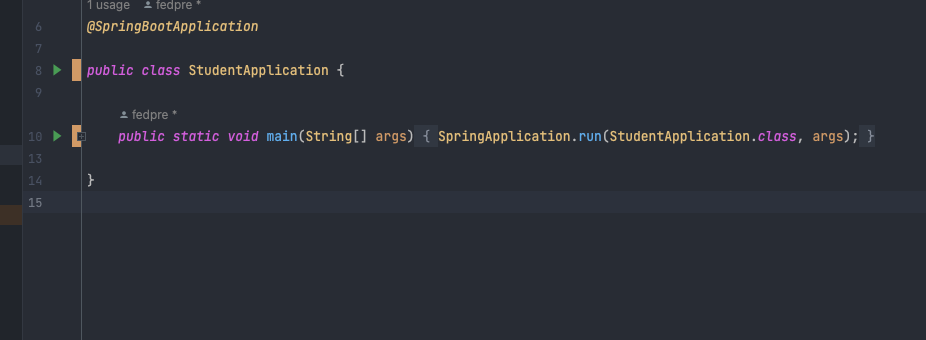

# Overview
The Student CRM web application allows the user to register new student in a database and retrieve the list of all the students. 

The purpose of writing this sofwtare is to explore and learn more about React for the frontend, Spring Boot for the backend. and PostgreSQL for the database. I wanted to explore how a relational database would work in conjunction with Spring Boot. I wanted to get real-world experience with these tools that are industry-standard.

### Start the local PostgreSQL database:
* Download PostgreSQL from [here](https://postgresapp.com/)
  * Follow the instruction to start the database
* Make sure that the database is up and running on port 5432 before starting the server


### Start the server locally: 
* Clone the GitHub repository
  * If you need to install IntelliJ, click on this [link](https://www.jetbrains.com/toolbox-app/)
* Start IntelliJ Community Edition
* Open the folder 'backend-crm'
* Open the "StudentApplication" java class

* Click on the green play button on the left of the code

* The server is now running on [http://localhost:8080/](http://localhost:8080/)
  * If you want to test the endpoint to get students, click [here](http://localhost:8080/api/v1/student)

### Open the web app in React: 
* Clone the GitHub repository (if you haven't done it in the step before)
* Open Visual Studio Code
  * If you need to download it and install it, click [here](https://code.visualstudio.com/download)
* Open a terminal window
* Navigate inside the 'crm-frontend' folder
* Run the command in the command-line 
  ```
  $ npm start
  ```
* The script will open the app on port 3000 of localhost
  * You can navigate to the app clickinh [here](http://localhost:3000/) after running the database, the server, and the react app
* Congratulations! The app is up and running.

Here is a video demonstration of starting the database, server, and React app as well as a demonstration of the software.

[Student CRM Demo Video](http://youtube.link.goes.here)

# Web Pages


I have used [React-Router](https://reactrouter.com/) to navigate between different pages. React doesn't come with the ability to move through different pages out of the box.

## Dashboard
The dashboard has two buttons
1. Register a new student
2. Show all students

Both buttons will change the screen and navigate to the respective pages. In the future work, I will have a graph with the stats on how many new students registered just below these two buttons.

## Registration
The registration page has three input field and a register button. The user input his information and the data are sent to the backend to the processed and registered in the database.

## Students
The students page shows dynamically, through a GET request to the RESTApi endpoint, all the students saved in the database. In the future, there will be the possibility to select a student and modify or delete it.

# Development Environment
* React
* Vistual Studio Code
* Spring Boot
* IntelliJ Community Edition
* PostgreSQL
* MUI

* Java
* JavaScript
* SQL

# Useful Websites
* [Spring Boot Initialized](https://spring.io/) 
* [Spring Boot Project Initializer](https://start.spring.io/)
* [Beginner Spring Boot Tutorial: REST API](https://www.youtube.com/watch?v=9SGDpanrc8U)
* [Complete User Login Registration Backend](https://www.youtube.com/watch?v=QwQuro7ekvc&t=163s)
* [Spring Boot Project Initializer](https://start.spring.io/#!type=maven-project&language=java&platformVersion=2.7.0&packaging=jar&jvmVersion=18&groupId=com.federico&artifactId=crm-backend&name=crm-backend&description=CRM%20application%20for%20business&packageName=com.federico.crm-backend&dependencies=lombok,web,security,postgresql,data-jpa,mail)
* [MUI Icons](https://mui.com/material-ui/material-icons/)
* [React Forms](https://reactjs.org/docs/forms.html)

# Future Work
* Allow the user to update and delete students from the UI
* Filter and sort students
* Show a graph in the Dashboard to see how many new students has been added in the past day, month, and year
